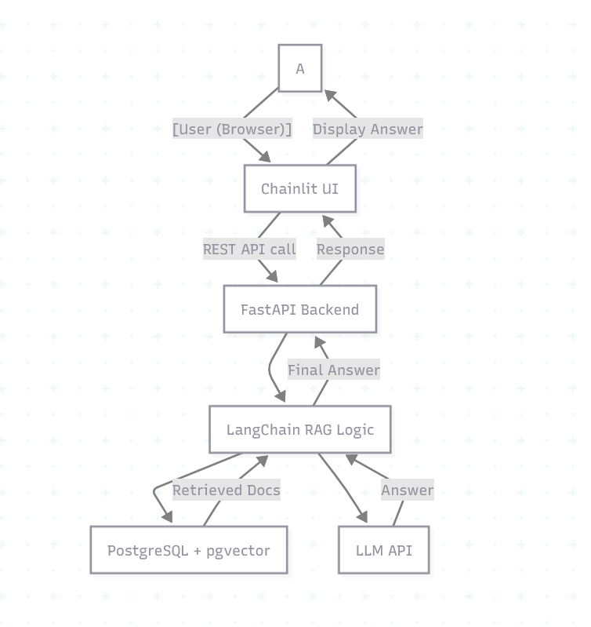

# CogniChain

CogniChain is a user-friendly AI chat application powered by Large Language Models (LLMs) and Retrieval Augmented Generation (RAG). It combines a sleek chat interface (Chainlit), a scalable FastAPI backend, LangChain for intelligent retrieval and reasoning, and PostgreSQL with pgvector for efficient vector search.

---

## 🚀 Features

- **Conversational AI**: Ask questions and get informative, context-aware answers.
- **Document Retrieval (RAG)**: Pulls relevant information from your knowledge base using embeddings and similarity search.
- **Vector Database**: Uses PostgreSQL with pgvector to store and search document embeddings.
- **LangChain Integration**: Leverages LangChain’s tools for document loading, prompt templates, and chaining logic.
- **Modern UI**: Built with Chainlit for a seamless chat experience.
- **Scalable Backend**: FastAPI powers the REST endpoints.

---

## 🗂️ Project Structure

```
project-root/
│
├── backend/
│   ├── app/
│   │   ├── main.py          # FastAPI app entrypoint
│   │   ├── rag.py           # LangChain RAG pipeline logic
│   │   ├── db.py            # PostgreSQL + pgvector connection
│   │   ├── models.py        # DB models/schemas
│   │   ├── utils.py         # Utility functions
│   │   └── config.py        # Settings (env, API keys)
│   ├── requirements.txt     # Backend dependencies
│   └── README.md
│
├── chainlit-ui/
│   ├── app.py               # Chainlit UI logic
│   ├── .chainlit/           # Chainlit config & assets
│   ├── requirements.txt     # Chainlit dependencies
│   └── README.md
│
├── data/
│   └── sample_docs/         # Sample documents for ingestion
│
├── scripts/
│   └── init_db.py           # DB initialization script
│
├── .env                     # Environment variables
├── docker-compose.yml       # (optional) Service orchestration
└── README.md
```

---

## ⚡ Quickstart

### 1. **Clone the repository**
```sh
git clone https://github.com/yourusername/CogniChain.git
cd CogniChain
```

### 2. **Set up PostgreSQL with pgvector**
- [Install PostgreSQL](https://www.postgresql.org/download/)
- Enable pgvector extension:
    ```sql
    CREATE EXTENSION IF NOT EXISTS vector;
    ```

### 3. **Backend Setup**
```sh
cd backend
python -m venv venv
source venv/bin/activate
pip install -r requirements.txt
# Copy and edit .env for DB and LLM keys
uvicorn app.main:app --reload
```

### 4. **Chainlit UI Setup**
```sh
cd ../chainlit-ui
python -m venv venv
source venv/bin/activate
pip install -r requirements.txt
chainlit run app.py
```

### 5. **Ingest Documents (Optional)**
Put your documents in `data/sample_docs/` and use provided scripts to embed and store them.

### 6. **Open the Chat UI**
Visit `http://localhost:8501` (or the port shown in Chainlit output) in your browser.

---

## 🛠️ Technologies Used

- **Chainlit** – Chat UI for LLM apps ([docs](https://docs.chainlit.io/))
- **FastAPI** – Fast, modern Python web API ([docs](https://fastapi.tiangolo.com/))
- **LangChain** – LLM app framework ([docs](https://python.langchain.com/))
- **PostgreSQL + pgvector** – Scalable vector database ([pgvector docs](https://github.com/pgvector/pgvector))
- **LLM Providers** – Gemini 2.5 flash.

---

## 🧩 Workflow Diagram



---

## 📝 Customization

- Add new document loaders in `backend/app/rag.py`
- Edit prompt templates in `backend/app/rag.py`
- Change database config in `.env` and `backend/app/config.py`
- Style Chainlit UI in `chainlit-ui/app.py` and `.chainlit/`

---

## 🤝 Contributing

1. Fork the repo
2. Create your feature branch: `git checkout -b feature/YourFeature`
3. Commit your changes: `git commit -am 'Add some feature'`
4. Push to the branch: `git push origin feature/YourFeature`
5. Open a Pull Request

---

## 📄 License

MIT License

---

## 📬 Contact

Questions, feedback, or collaboration?  
Open an issue or reach out at [your-email@example.com](mailto:your-email@example.com)
